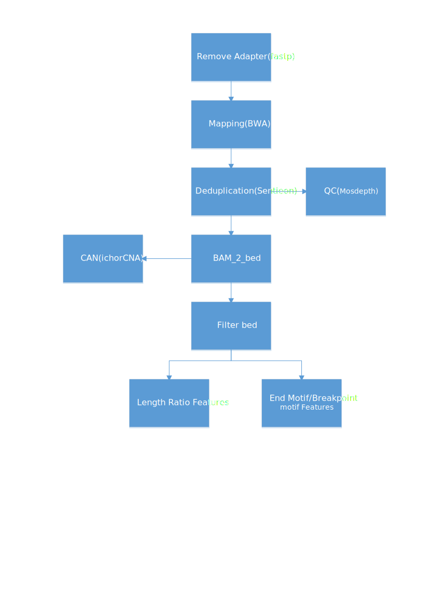

# cfDNA fragmentomics

## Workflow for the pipeline



## Software dependices

```bash
fastp
sentieon
r-ichorcna
bedtools
mosdepth
```

## Install

You can install [miniconda](https://docs.anaconda.com/miniconda/miniconda-install/), and using conda to install the required packages in a env named `fragmentomics` to run the script:

```bash
conda env create -f env.yml
```


Edit `config.json` edit it before using the pipeline.Replace `SCRIPT_DIR, R_ENV_PATH, ICHORCNA_DIR` and the path of the software according to your system.


## Usage

The `input_file` is a tsv file which specify the sample_id and path of fastq data.
Example for `inpu_file`

Sample_ID|fq_R1|fq_R2
-----|-----|----
sample_id|path_of_fq1|path_of_fq2

You can run the pipeline using the following command

```bash
# Use the following command to generate shell script to run the pipeline
fragmentomics_get_shell.py {input_file} {config.json} {output_dir}
# then run the generated shell script in output_dir
bash all_run_script.sh
```